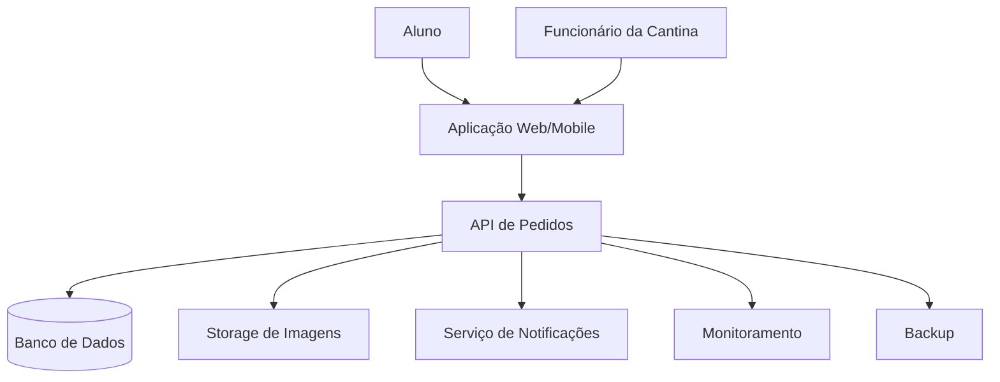
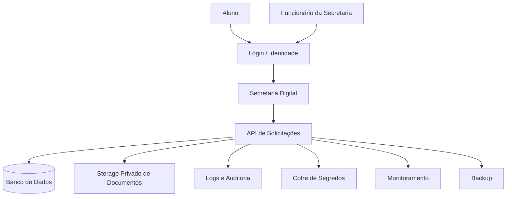
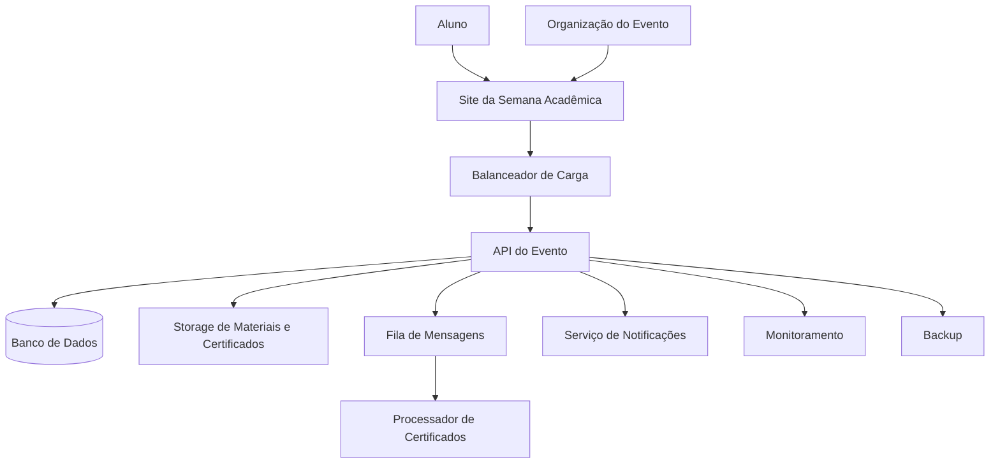

# Resposta — Cenário 1

## A Cantina Sumiu com Meu Pedido

## 1. Problema principal

A cantina da faculdade enfrenta dificuldade para organizar pedidos em horários de pico. As filas ficam grandes, pedidos podem ser anotados incorretamente e os funcionários não conseguem acompanhar com clareza quais produtos vendem mais e quais pedidos ainda estão pendentes.

O principal problema é criar uma solução que organize os pedidos, facilite o atendimento e suporte muitos acessos nos horários de intervalo.

---

## 2. Componentes escolhidos

| Componente              |    Usar? | Justificativa                                                             |
| ----------------------- | -------: | ------------------------------------------------------------------------- |
| Aplicação Web ou Mobile |      Sim | Para que os alunos visualizem o cardápio e façam pedidos.                 |
| API / Backend           |      Sim | Para controlar as regras dos pedidos, status e comunicação com o banco.   |
| Banco de Dados          |      Sim | Para armazenar pedidos, usuários, produtos e histórico.                   |
| Storage de Arquivos     |      Sim | Para armazenar imagens dos produtos da cantina.                           |
| Login / Identidade      |      Sim | Para identificar alunos e funcionários da cantina.                        |
| Notificações            |      Sim | Para avisar o aluno quando o pedido estiver pronto.                       |
| Monitoramento           |      Sim | Para acompanhar erros, lentidão e horários de maior uso.                  |
| Backup                  |      Sim | Para evitar perda de dados dos pedidos e cadastros.                       |
| Segurança / Firewall    |      Sim | Para proteger o sistema contra acessos indevidos.                         |
| Balanceador de Carga    | Opcional | Útil se muitos alunos acessarem ao mesmo tempo.                           |
| Fila de Mensagens       | Opcional | Pode ser usada para organizar notificações e pedidos em momentos de pico. |

---

## 3. Arquitetura proposta

---

## 4. Explicação da arquitetura

Os alunos acessam o sistema por uma aplicação web ou mobile. Essa aplicação se comunica com uma API, que centraliza as regras do sistema.

A API registra os pedidos no banco de dados, consulta o cardápio e atualiza o status dos pedidos. As imagens dos produtos ficam em um serviço separado de armazenamento de arquivos, pois não é adequado guardar muitas imagens diretamente no banco de dados.

Quando o pedido fica pronto, o sistema envia uma notificação ao aluno. O monitoramento permite verificar falhas, lentidão e horários de maior movimento.

---

## 5. Decisão de segurança

Uma decisão importante é separar os perfis de acesso.

Exemplo:

* aluno pode fazer e acompanhar seus próprios pedidos;
* funcionário pode visualizar e alterar pedidos da cantina;
* administrador pode cadastrar produtos e consultar relatórios.

Além disso, os dados de login devem ser protegidos, e os funcionários não devem acessar informações que não sejam necessárias para o atendimento.

---

## 6. Comparação com Azure, AWS e Google Cloud

| Função               | Azure                                     | AWS                     | Google Cloud              |
| -------------------- | ----------------------------------------- | ----------------------- | ------------------------- |
| Aplicação            | App Service / Container Apps              | Elastic Beanstalk / ECS | Cloud Run                 |
| Banco de dados       | Azure SQL / Azure Database for PostgreSQL | Amazon RDS              | Cloud SQL                 |
| Imagens dos produtos | Blob Storage                              | Amazon S3               | Cloud Storage             |
| Login / identidade   | Microsoft Entra ID                        | Cognito / IAM           | Identity Platform / IAM   |
| Notificações         | Azure Functions / Service Bus             | SNS / Lambda            | Pub/Sub / Cloud Functions |
| Monitoramento        | Azure Monitor                             | CloudWatch              | Cloud Monitoring          |
| Segredos e senhas    | Key Vault                                 | Secrets Manager         | Secret Manager            |

---

## 7. Justificativa final

A arquitetura é adequada porque separa as responsabilidades do sistema. A aplicação permite o acesso dos usuários, a API concentra as regras de negócio, o banco armazena os pedidos, o storage guarda imagens dos produtos e o serviço de notificação melhora a comunicação com os alunos.

Essa solução também permite crescimento futuro. Caso muitos alunos acessem ao mesmo tempo, a instituição pode aumentar a capacidade da aplicação ou usar um balanceador de carga.

---

## Resposta — Cenário 2

## A Secretaria Digital da Faculdade

## 1. Problema principal 2

A secretaria da faculdade recebe muitos pedidos de documentos por canais diferentes, como e-mail, telefone e atendimento presencial. Isso causa perda de solicitações, demora no atendimento e risco de envio de documentos para pessoas erradas.

O principal problema é criar uma solução digital segura, organizada e com controle de acesso, pois o sistema lida com dados pessoais e acadêmicos.

---

## 2. Componentes escolhidos 2

| Componente           |    Usar? | Justificativa                                                     |
| -------------------- | -------: | ----------------------------------------------------------------- |
| Aplicação Web        |      Sim | Para alunos e funcionários acessarem o sistema.                   |
| API / Backend        |      Sim | Para controlar solicitações, aprovações e permissões.             |
| Banco de Dados       |      Sim | Para armazenar usuários, pedidos e status das solicitações.       |
| Storage de Arquivos  |      Sim | Para armazenar documentos gerados, como declarações e históricos. |
| Login / Identidade   |      Sim | Essencial para identificar alunos e funcionários.                 |
| Monitoramento        |      Sim | Para acompanhar falhas e acessos importantes.                     |
| Logs / Auditoria     |      Sim | Para registrar quem acessou ou alterou documentos.                |
| Backup               |      Sim | Para evitar perda de dados acadêmicos.                            |
| Segurança / Firewall |      Sim | Para proteger dados sensíveis.                                    |
| Cofre de Segredos    |      Sim | Para proteger senhas, chaves e credenciais.                       |
| Fila de Mensagens    | Opcional | Pode ser usada para processar documentos solicitados.             |
| Notificações         | Opcional | Pode avisar o aluno quando o documento estiver pronto.            |

---

## 3. Arquitetura proposta 2

---

## 4. Explicação da arquitetura 2

O aluno acessa a Secretaria Digital usando login. Depois de autenticado, pode solicitar documentos e acompanhar o andamento do pedido.

Os funcionários também acessam o sistema com login, mas possuem outro perfil de permissão. Eles podem visualizar solicitações, aprovar, rejeitar ou concluir pedidos.

O banco de dados armazena informações sobre alunos, solicitações e status. Os documentos gerados ficam em um storage privado, e não devem ser acessíveis diretamente pela internet.

Os logs registram ações importantes, como quem acessou determinado documento ou quem alterou uma solicitação. O cofre de segredos armazena senhas, chaves de acesso e informações sensíveis do sistema.

---

## 5. Decisão de segurança 2

A principal decisão de segurança é que os documentos dos alunos devem ficar em armazenamento privado.

Ou seja:

* um aluno só pode acessar os próprios documentos;
* funcionários só acessam documentos necessários ao trabalho;
* o sistema deve registrar acessos importantes;
* senhas e chaves não devem ficar expostas no código;
* o banco de dados não deve ficar aberto diretamente para a internet.

Essa é a missão em que a segurança tem maior peso.

---

## 6. Comparação com Azure, AWS e Google Cloud 2

| Função               | Azure                        | AWS                     | Google Cloud                         |
| -------------------- | ---------------------------- | ----------------------- | ------------------------------------ |
| Aplicação            | App Service / Container Apps | Elastic Beanstalk / ECS | Cloud Run                            |
| Banco de dados       | Azure SQL / PostgreSQL       | Amazon RDS              | Cloud SQL                            |
| Documentos           | Blob Storage                 | Amazon S3               | Cloud Storage                        |
| Login / identidade   | Microsoft Entra ID           | Cognito / IAM           | Identity Platform / IAM              |
| Segredos e senhas    | Key Vault                    | Secrets Manager         | Secret Manager                       |
| Logs e auditoria     | Azure Monitor                | CloudWatch              | Cloud Logging                        |
| Segurança de entrada | Application Gateway / WAF    | AWS WAF / Load Balancer | Cloud Armor / Load Balancing         |
| Backup               | Azure Backup                 | AWS Backup              | Backup and DR / soluções gerenciadas |

---

## 7. Justificativa final 2

A arquitetura é adequada porque prioriza segurança e controle de acesso. Como o sistema lida com documentos acadêmicos e dados pessoais, é essencial proteger o login, restringir permissões e armazenar documentos de forma privada.

A separação entre aplicação, API, banco, storage, logs e cofre de segredos torna o sistema mais organizado, seguro e fácil de manter.

---

## Resposta — Cenário 3

## Semana Acadêmica em Chamas

## 1. Problema principal 3

A faculdade precisa organizar uma Semana Acadêmica com inscrições, oficinas, materiais, controle de presença, comunicados e certificados. Em eventos anteriores, o sistema travou por causa do grande número de acessos no primeiro dia de inscrição.

O principal problema é criar uma solução que suporte picos de acesso e organize tarefas que podem ser processadas depois, como emissão de certificados e envio de comunicados.

---

## 2. Componentes escolhidos 3

| Componente           | Usar? | Justificativa                                                   |
| -------------------- | ----: | --------------------------------------------------------------- |
| Aplicação Web        |   Sim | Para os alunos realizarem inscrições e consultarem informações. |
| API / Backend        |   Sim | Para controlar inscrições, oficinas, presença e certificados.   |
| Banco de Dados       |   Sim | Para armazenar alunos, inscrições, oficinas e presenças.        |
| Storage de Arquivos  |   Sim | Para armazenar materiais dos palestrantes e certificados.       |
| Login / Identidade   |   Sim | Para identificar alunos e organizadores.                        |
| Fila de Mensagens    |   Sim | Para processar certificados e avisos sem travar o sistema.      |
| Notificações         |   Sim | Para enviar avisos sobre salas, horários e certificados.        |
| Monitoramento        |   Sim | Para identificar sobrecarga, erros e lentidão.                  |
| Backup               |   Sim | Para proteger inscrições e registros de presença.               |
| Segurança / Firewall |   Sim | Para proteger o sistema contra acessos indevidos.               |
| Balanceador de Carga |   Sim | Para distribuir acessos em momentos de pico.                    |

---

## 3. Arquitetura proposta 3

---

## 4. Explicação da arquitetura 3

Os alunos acessam o site da Semana Acadêmica para realizar inscrições, escolher oficinas e consultar informações. O site se comunica com uma API responsável pelas regras do evento.

O banco de dados armazena as inscrições, oficinas, controle de presença e dados dos participantes. Os materiais dos palestrantes e certificados ficam em storage de arquivos.

Como a emissão de certificados pode ser uma tarefa mais pesada, ela pode ser enviada para uma fila. Assim, o sistema não precisa gerar todos os certificados imediatamente durante um momento de alto uso.

O balanceador de carga ajuda a distribuir acessos quando muitos alunos entram no sistema ao mesmo tempo. O monitoramento permite identificar se o sistema está lento ou sobrecarregado.

---

## 5. Decisão de segurança 3

Uma decisão importante é controlar os perfis de acesso.

Exemplo:

* aluno pode se inscrever e consultar sua participação;
* organizador pode gerenciar oficinas e presenças;
* administrador pode visualizar relatórios e configurar o evento.

Além disso, a lista de inscritos e os certificados não devem ficar públicos. Cada aluno deve acessar apenas suas próprias informações.

---

## 6. Comparação com Azure, AWS e Google Cloud 3

| Função                        | Azure                                    | AWS                     | Google Cloud         |
| ----------------------------- | ---------------------------------------- | ----------------------- | -------------------- |
| Aplicação                     | App Service / Container Apps             | Elastic Beanstalk / ECS | Cloud Run            |
| Banco de dados                | Azure SQL / PostgreSQL                   | Amazon RDS              | Cloud SQL            |
| Materiais e certificados      | Blob Storage                             | Amazon S3               | Cloud Storage        |
| Fila de mensagens             | Service Bus                              | SQS                     | Pub/Sub              |
| Processamento de certificados | Azure Functions                          | Lambda                  | Cloud Functions      |
| Notificações                  | Azure Functions / Communication Services | SNS                     | Pub/Sub / Firebase   |
| Monitoramento                 | Azure Monitor                            | CloudWatch              | Cloud Monitoring     |
| Segurança                     | Key Vault / Entra ID                     | IAM / Secrets Manager   | IAM / Secret Manager |
| Balanceamento                 | Application Gateway                      | Elastic Load Balancer   | Cloud Load Balancing |

---

## 7. Justificativa final 3

A arquitetura é adequada porque separa as atividades principais do sistema e permite lidar melhor com picos de acesso. A inscrição dos alunos precisa ser rápida, mas tarefas como emissão de certificados e envio de avisos podem ser processadas depois por meio de uma fila.

Essa solução evita que o sistema trave ao tentar fazer tudo ao mesmo tempo. Além disso, o uso de monitoramento permite acompanhar problemas durante o evento e agir rapidamente em caso de falhas.

---

## Comparação geral entre os três cenários

| Cenário            | Principal preocupação            | Componentes mais importantes                                         |
| ------------------ | -------------------------------- | -------------------------------------------------------------------- |
| Cantina            | Organização e pico de pedidos    | Aplicação, API, banco, notificações e monitoramento                  |
| Secretaria Digital | Segurança e dados sensíveis      | Login, controle de acesso, storage privado, logs e cofre de segredos |
| Semana Acadêmica   | Escalabilidade e picos de acesso | Balanceador, fila, banco, storage, notificações e monitoramento      |

---

## Observação

As respostas não precisam ser exatamente iguais a essas. O mais importante é verificar se:

* entendeu o problema;
* escolheu componentes coerentes;
* conseguiu justificar as escolhas;
* pensou em segurança;
* conseguiu relacionar a solução com Azure, AWS e Google Cloud;
* fez um desenho compreensível da arquitetura.

Uma resposta pode ser considerada boa mesmo usando menos componentes, desde que esteja bem justificada.
