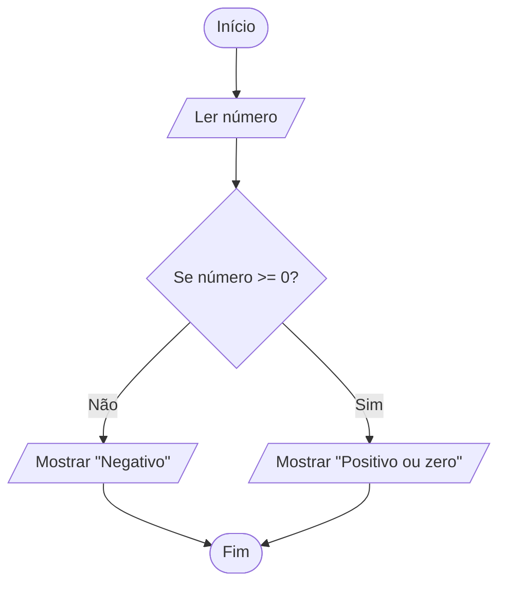
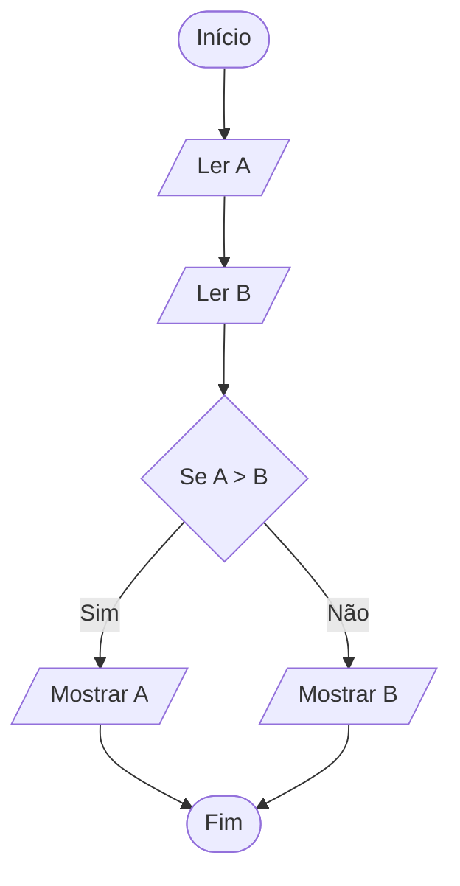
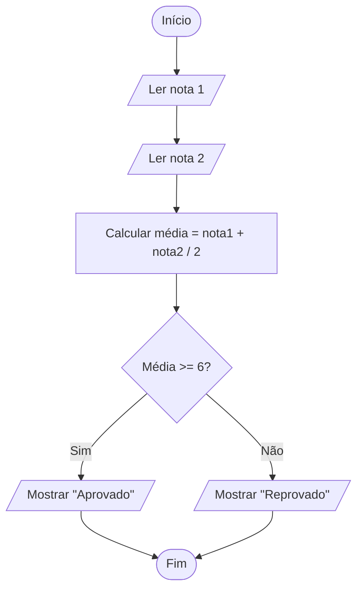
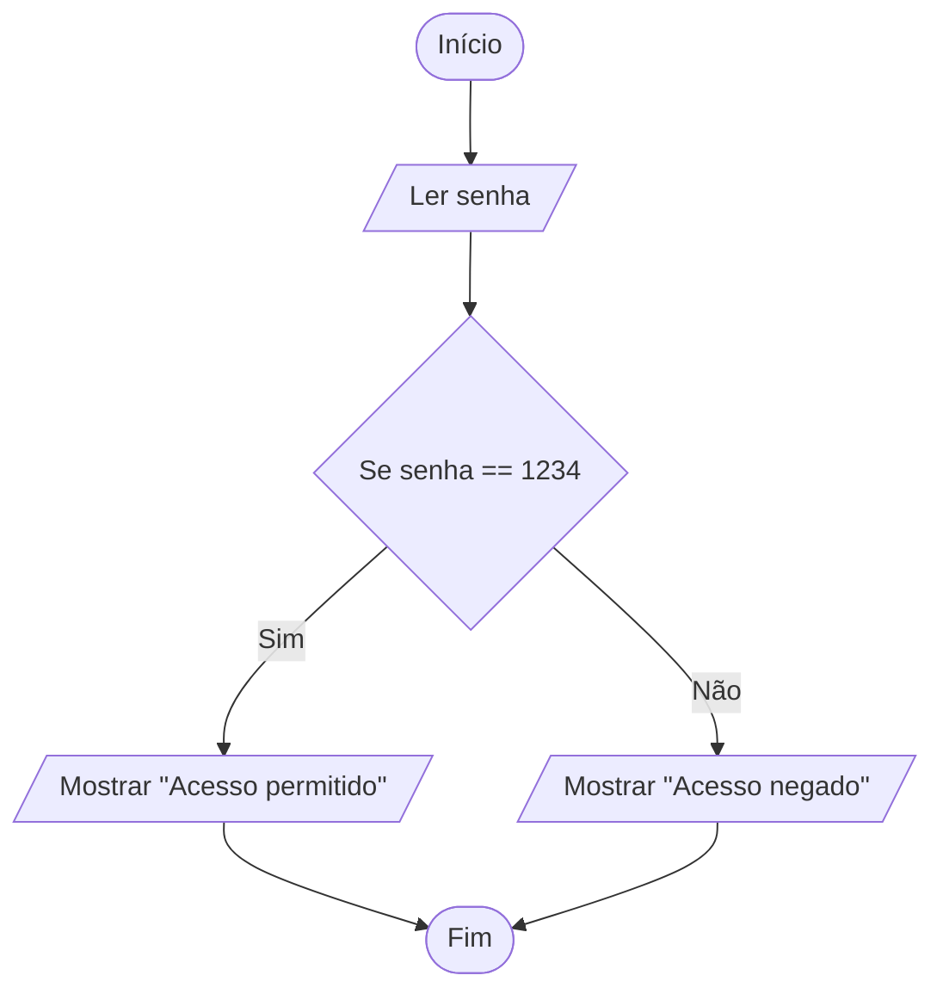
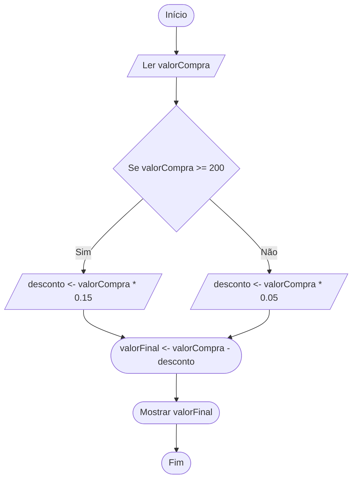

# Lista de Exercícios Práticos de C

## Introdução à Computação

## Parte 1 — Primeiros programas em C

### 1. Primeiro programa em C

Crie um programa em C que mostre na tela a mensagem:

```c
Olá, mundo!
```

---

### 2. Apresentação pessoal

Crie um programa que mostre seu nome, sua idade e seu curso em linhas separadas.

Exemplo de saída:

```text
Nome: Ana
Idade: 18
Curso: Ciência da Computação
```

---

### 3. Soma de dois números

Crie um programa que leia dois números inteiros e mostre a soma entre eles.

---

### 4. Média de duas notas

Crie um programa que leia duas notas reais e calcule a média aritmética.

---

### 5. Conversão de temperatura

Crie um programa que leia uma temperatura em Celsius e converta para Fahrenheit.

Fórmula:

```text
F = C * 9 / 5 + 32
```

---

## Parte 2 — Traduzindo Portugol para C

### 6. Traduza o Portugol para C

Portugol:

```text
algoritmo "idade"
var
   idade: inteiro
inicio
   escreva("Digite sua idade: ")
   leia(idade)
   escreva("Sua idade é: ", idade)
fimalgoritmo
```

Tarefa: escreva esse algoritmo em linguagem C.

---

### 7. Traduza o Portugol para C

Portugol:

```text
algoritmo "soma"
var
   a, b, resultado: inteiro
inicio
   leia(a)
   leia(b)
   resultado <- a + b
   escreva(resultado)
fimalgoritmo
```

Tarefa: traduza para C usando `scanf` e `printf`.

---

### 8. Traduza o Portugol para C

Portugol:

```text
algoritmo "produto"
var
   preco, total: real
   quantidade: inteiro
inicio
   leia(preco)
   leia(quantidade)
   total <- preco * quantidade
   escreva(total)
fimalgoritmo
```

Tarefa: crie a versão em C.

---

### 9. Traduza o Portugol para C

Portugol:

```text
algoritmo "area_retangulo"
var
   base, altura, area: real
inicio
   escreva("Digite a base: ")
   leia(base)
   escreva("Digite a altura: ")
   leia(altura)
   area <- base * altura
   escreva("Área: ", area)
fimalgoritmo
```

Tarefa: escreva o programa correspondente em C.

---

### 10. Traduza o Portugol para C

Portugol:

```text
algoritmo "dobro"
var
   numero, dobro: inteiro
inicio
   leia(numero)
   dobro <- numero * 2
   escreva("O dobro é: ", dobro)
fimalgoritmo
```

Tarefa: implemente em C.

---

## Parte 3 — Linguagem natural para C

### 11. Maioridade

Crie um programa que leia a idade de uma pessoa e informe se ela é maior de idade.

Considere maior de idade quem tem 18 anos ou mais.

---

### 12. Número positivo

Crie um programa que leia um número inteiro e informe se ele é positivo.

---

### 13. Número par

Crie um programa que leia um número inteiro e informe se ele é par.

Dica: use o operador `%`.

---

### 14. Aprovação simples

Crie um programa que leia a nota de um aluno.

Se a nota for maior ou igual a 6, mostre:

```text
Aprovado
```

Caso contrário, mostre:

```text
Reprovado
```

---

### 15. Cálculo de desconto

Crie um programa que leia o preço de um produto.

Se o preço for maior que 100, aplique 10% de desconto.

Mostre o valor final do produto.

---

## Parte 4 — Fluxograma para C

### 16. Fluxograma: número positivo ou negativo

Converta o fluxograma abaixo para C:



---

### 17. Fluxograma: maior entre dois números

Converta para C:



---

### 18. Fluxograma: média do aluno

Converta para C:



---

### 19. Fluxograma: senha simples

Converta para C:



---

### 20. Fluxograma: compra com desconto

Converta para C:



---

## Parte 5 — Exercícios com `if`

### 21. Verificar idade mínima

Crie um programa que leia a idade de uma pessoa.

Se a idade for maior ou igual a 16, mostre:

```text
Pode votar
```

Senão, mostre:

```text
Ainda não pode votar
```

---

### 22. Verificar número negativo

Leia um número inteiro.

Se ele for menor que zero, mostre:

```text
Número negativo
```

Caso contrário, mostre:

```text
Número não negativo
```

---

### 23. Verificar múltiplo de 5

Leia um número inteiro e informe se ele é múltiplo de 5.

---

### 24. Verificar temperatura

Leia uma temperatura.

Se for maior que 30, mostre:

```text
Dia quente
```

Caso contrário, mostre:

```text
Temperatura agradável ou fria
```

---

### 25. Comparar dois números

Leia dois números inteiros.

Informe se eles são iguais ou diferentes.

---

## Parte 6 — Exercícios com `if`, `else if` e `if` encadeado

### 26. Classificação de nota

Leia uma nota de 0 a 10 e mostre a classificação:

```text
Nota >= 9: Excelente
Nota >= 7: Bom
Nota >= 6: Regular
Nota < 6: Insuficiente
```

---

### 27. Maior entre três números

Leia três números inteiros e mostre qual é o maior.

---

### 28. Menor entre três números

Leia três números inteiros e mostre qual é o menor.

---

### 29. Classificação de temperatura

Leia uma temperatura e classifique:

```text
Abaixo de 15: Frio
De 15 até 25: Agradável
Acima de 25 até 35: Quente
Acima de 35: Muito quente
```

---

### 30. Situação do aluno

Leia a média final de um aluno e classifique:

```text
Média >= 7: Aprovado
Média >= 4 e < 7: Prova final
Média < 4: Reprovado
```

---

### 31. Tipo de triângulo

Leia três lados de um triângulo.

Primeiro verifique se os lados formam um triângulo.

Depois, classifique:

```text
Equilátero: três lados iguais
Isósceles: dois lados iguais
Escaleno: três lados diferentes
```

---

### 32. Login simples

Crie um programa que leia um usuário e uma senha.

Considere:

```text
Usuário correto: admin
Senha correta: 1234
```

Mostre:

```text
Login realizado com sucesso
```

ou

```text
Usuário ou senha inválidos
```

---

## Parte 7 — Exercícios com `switch-case`

### 33. Dia da semana

Leia um número de 1 a 7 e mostre o dia correspondente:

```text
1 - Domingo
2 - Segunda
3 - Terça
4 - Quarta
5 - Quinta
6 - Sexta
7 - Sábado
```

Use `switch-case`.

---

### 34. Menu de operações matemáticas

Crie um programa que leia dois números e uma opção:

```text
1 - Somar
2 - Subtrair
3 - Multiplicar
4 - Dividir
```

Use `switch-case` para executar a operação escolhida.

---

### 35. Conceito por letra

Leia uma letra e mostre o significado:

```text
A - Excelente
B - Bom
C - Regular
D - Insuficiente
```

Use `switch-case`.

---

### 36. Mês do ano

Leia um número de 1 a 12 e mostre o nome do mês correspondente.

Use `switch-case`.

---

### 37. Menu de cadastro simples

Crie um programa com o seguinte menu:

```text
1 - Cadastrar aluno
2 - Listar alunos
3 - Buscar aluno
4 - Sair
```

Por enquanto, o programa deve apenas mostrar uma mensagem para cada opção.

Exemplo:

```text
Opção 1 escolhida: cadastrar aluno.
```

---

### 38. Calculadora de área

Crie um programa com menu:

```text
1 - Área do quadrado
2 - Área do retângulo
3 - Área do triângulo
4 - Área do círculo
```

O usuário escolhe uma opção, informa os dados necessários e o programa calcula a área.

---

## Parte 8 — Exercícios com funções simples

### 39. Função para somar dois números

Crie uma função chamada `somar` que receba dois números inteiros e retorne a soma.

No `main`, leia dois números, chame a função e mostre o resultado.

---

### 40. Função para calcular média

Crie uma função chamada `calcularMedia` que receba duas notas e retorne a média.

---

### 41. Função para verificar número par

Crie uma função chamada `ehPar` que receba um número inteiro.

A função deve retornar `1` se o número for par e `0` caso contrário.

---

### 42. Função para calcular o dobro

Crie uma função chamada `calcularDobro` que receba um número inteiro e retorne o dobro dele.

---

### 43. Função para converter Celsius para Fahrenheit

Crie uma função que receba uma temperatura em Celsius e retorne o valor em Fahrenheit.

---

### 44. Função para encontrar o maior número

Crie uma função chamada `maiorNumero` que receba dois números inteiros e retorne o maior deles.

---

## Parte 9 — Exercícios com repetição

### 45. Contagem de 1 até N

Leia um número inteiro `N`.

Mostre todos os números de 1 até `N`.

---

### 46. Soma de 1 até N

Leia um número inteiro positivo `N`.

Calcule e mostre a soma:

```text
1 + 2 + 3 + ... + N
```

---

### 47. Tabuada

Leia um número inteiro e mostre a tabuada dele de 1 a 10.

Exemplo:

```text
5 x 1 = 5
5 x 2 = 10
...
5 x 10 = 50
```

---

### 48. Validação de nota

Leia uma nota.

Enquanto a nota for menor que 0 ou maior que 10, peça para o usuário digitar novamente.

Ao final, mostre:

```text
Nota válida
```

---

### 49. Contador de pares

Leia 10 números inteiros.

Conte quantos deles são pares.

Ao final, mostre a quantidade de números pares digitados.

---

### 50. Menu com repetição

Crie um programa com o seguinte menu:

```text
1 - Somar dois números
2 - Verificar se um número é par
3 - Calcular média de duas notas
0 - Sair
```

O menu deve continuar aparecendo até o usuário escolher a opção `0`.

---

## Locais recomendados para estudo e prática

Aprender programação não significa decorar todos os comandos. Um bom programador aprende também a **consultar documentação**, testar exemplos, errar, corrigir e pesquisar soluções de forma responsável.

A documentação deve ser vista como uma ferramenta de trabalho. Em C, é comum consultar informações sobre funções como `printf`, `scanf`, estruturas de repetição, operadores, bibliotecas e comportamento da linguagem.

## 1. Documentação e referência da linguagem C

### cppreference — Referência de C

O **cppreference** é uma das referências mais completas para consulta da linguagem C. Ele possui seções sobre conceitos básicos, palavras-chave, expressões, funções, bibliotecas, entrada e saída, strings, memória dinâmica e outros recursos da linguagem. ([Cppreference][1])

Uso recomendado:

```text
Consultar quando tiver dúvida sobre:
- printf
- scanf
- tipos de dados
- operadores
- strings
- funções da biblioteca padrão
- estruturas da linguagem C
```

---

### GNU C Manual

O **GNU C Manual** é uma referência ligada ao uso da linguagem C com o compilador GCC. Ele pode ser usado tanto como material de leitura quanto como consulta, principalmente quando o aluno começar a usar o GCC em ambientes como Linux, Windows com MinGW ou plataformas online. ([GNU][2])

Uso recomendado:

```text
Consultar quando quiser entender:
- funcionamento da linguagem C
- compilação com GCC
- detalhes da linguagem
- exemplos mais formais
```

---

## 2. Sites para praticar programação

### W3Schools — Tutorial de C para iniciantes

O **W3Schools** possui uma seção dedicada à linguagem C, com explicações curtas, exemplos simples e exercícios interativos.([w3schols][5])

Uso recomendado:

```text
Consultar quando quiser:
- revisar a sintaxe básica de C
- ver exemplos simples de código
- praticar pequenos exercícios
- entender comandos como if, switch, while, for, funções e arrays
```

O W3Schools é interessante para quem está começando porque apresenta os conteúdos em uma linguagem direta e com exemplos pequenos. Porém, ele deve ser usado como **material complementar**.

Para dúvidas mais detalhadas ou técnicas, é recomendável consultar também referências como:

```text
- cppreference
- GNU C Manual
- documentação do compilador utilizado
```

Sugestão para os alunos:

```text
Use o W3Schools para começar e praticar.
Use a documentação para aprofundar e confirmar detalhes da linguagem.
```

---

### beecrowd

O **beecrowd** é uma plataforma bastante usada no Brasil para praticar programação com problemas organizados por categorias. Ele é muito útil para treinar entrada, saída, condições, repetição, funções e raciocínio lógico. A plataforma também funciona como juiz online, ou seja, o aluno envia o código e recebe uma resposta indicando se a solução está correta. ([beecrowd][3])

Uso recomendado para iniciantes:

```text
Começar pelos problemas básicos:
- entrada e saída
- soma
- média
- operações matemáticas
- estruturas condicionais
- repetição
```

Sugestão para os alunos:

```text
Não copie soluções prontas.
Leia o enunciado, tente resolver, teste exemplos e só depois procure ajuda.
```

---

### Exercism — Trilha de C

O **Exercism** possui uma trilha específica para C com exercícios progressivos. A plataforma informa que a trilha de C possui dezenas de exercícios e permite praticar conceitos da linguagem com análise automática e mentoria. ([Exercism][4])

Uso recomendado:

```text
Praticar:
- funções
- strings
- organização de código
- testes
- resolução gradual de problemas
```

---

## 3. Ambientes online para testar código

Além de instalar um compilador no computador, o aluno pode usar ambientes online para testar códigos simples em C.

Exemplos de uso:

```text
- Testar exemplos vistos em aula
- Conferir erros de sintaxe
- Fazer pequenos programas
- Comparar diferentes soluções
```

Mas é importante lembrar:

```text
Ambiente online ajuda no começo, mas o aluno também deve aprender a compilar no próprio computador.
```

---

## 4. Como estudar programação do jeito certo

Ao estudar C, siga este processo:

```text
1. Leia o enunciado com calma.
2. Identifique as entradas do programa.
3. Identifique os processamentos necessários.
4. Identifique as saídas esperadas.
5. Escreva primeiro em linguagem natural ou Portugol.
6. Depois traduza para C.
7. Compile o programa.
8. Corrija os erros.
9. Teste com valores diferentes.
10. Explique o código com suas próprias palavras.
```

---

## 5. O que evitar

Evite estudar apenas copiando código pronto.

```text
Copiar código pode até fazer o programa funcionar,
mas não garante que você aprendeu a resolver o problema.
```

Também evite depender apenas de vídeos. Vídeos ajudam, mas a prática real acontece quando o aluno escreve, compila, testa e corrige o próprio código.

---

## 6. Conselho final para os alunos

Programar é uma habilidade prática. Assim como aprender matemática, música ou esporte, só melhora com repetição e treino.

```text
Erros fazem parte do aprendizado.
Cada erro corrigido é um passo a mais para entender melhor a linguagem.
```

A documentação, os exercícios e os testes devem fazer parte da rotina de estudo. O objetivo não é decorar tudo, mas aprender a pensar, consultar boas fontes e transformar problemas em programas.

[1]: https://cppreference.com/c "C reference"
[2]: https://www.gnu.org/software/c-intro-and-ref/manual/c-intro-and-ref.html "GNU C Language Manual"
[3]: https://judge.beecrowd.com/pt/login "Entrar - Login - beecrowd"
[4]: https://exercism.org/tracks/c "C"
[5]: https://www.w3schools.com/c/index.php "w3schools"
