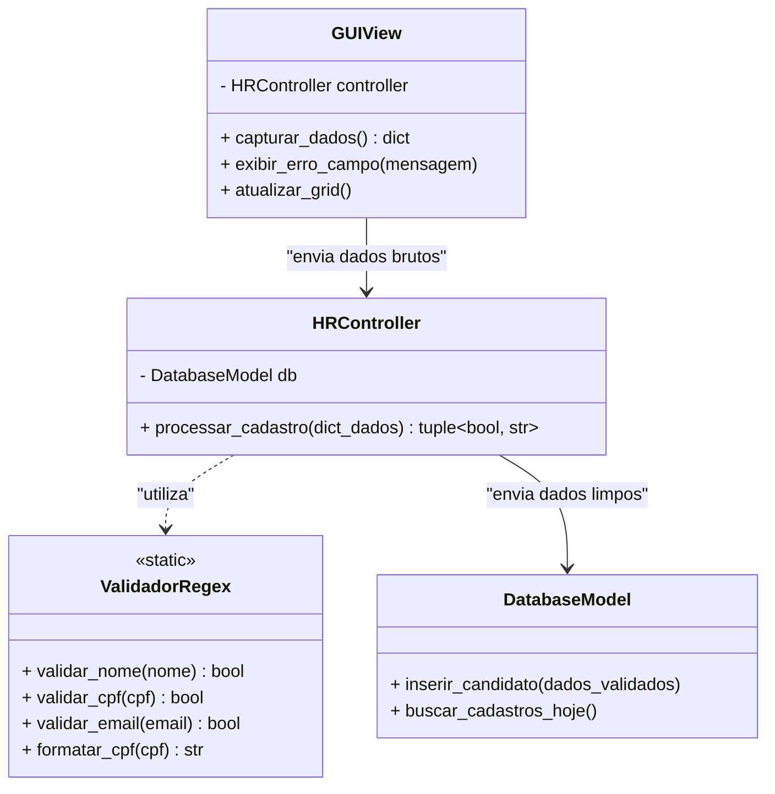

# Desafio de Projeto: Sistema "HR-Valida"

## Terminal Local de Pré-Cadastro e Onboarding de Colaboradores

### 1. Contexto do Cenário

O Departamento Pessoal de uma grande rede de varejo utiliza um sistema central na nuvem (ERP), mas o pré-cadastro dos novos funcionários nas filiais é feito de forma offline, através de um terminal desktop na sala do RH local. Isso ocorre porque os dados inseridos são altamente sensíveis (LGPD) e o sistema precisa garantir que absolutamente nenhuma informação fora do padrão seja salva no banco de dados local (`onboarding.db`) antes da sincronização noturna.

O seu papel como desenvolvedor é construir essa aplicação de pré-cadastro utilizando **Tkinter** e **SQLite**, com um foco extremo na validação e sanitização dos dados de entrada.

---

### 2. Requisitos do Sistema

#### **R01: Persistência (SQLite)**

O banco de dados `onboarding.db` deve ter a tabela `candidatos` com:

* `id` (INTEGER, Primary Key)
* `nome_completo` (TEXT)
* `cpf` (TEXT, Único)
* `email_corporativo` (TEXT)
* `telefone` (TEXT)
* `data_nascimento` (TEXT)

#### **R02: Interface Gráfica e Troca de Informação (Tkinter)**

O fluxo deve ser dividido na mesma tela, exigindo que o aluno gerencie o estado dos dados:

* **Formulário de Cadastro:** Campos para preenchimento dos dados.
* **Feedback Visual:** A interface deve ter uma área de mensagens (`Label` inferior) que informa exatamente qual campo falhou na validação.
* **Botões:** `Validar e Salvar`, `Limpar` e `Exportar Logs` (simulando a exportação dos dados do dia).
* **Grid de Conferência:** Um `Treeview` mostrando os cadastros aprovados e salvos na sessão atual.

#### **R03: Regras de Negócio de "Data Cleansing" (Obrigatório o uso de REGEX)**

Nenhum dado pode ser salvo no SQLite sem passar pelos seguintes filtros Regex no Controller:

1. **Nome Completo:** Deve conter pelo menos Nome e Sobrenome, apenas letras (aceitando acentuação) e espaços. Sem números ou caracteres especiais.
2. **CPF:** O usuário pode digitar com ou sem pontuação, mas a Regex deve aceitar os formatos `123.456.789-00` ou `12345678900`. No banco, deve ser salvo *sempre* no formato formatado (com pontuação).
3. **E-mail Corporativo:** Deve obrigatoriamente terminar com uma extensão específica da empresa, por exemplo: `^[a-zA-Z0-9._%+-]+@varejotech\.com\.br$`. Se for um gmail/hotmail, o sistema deve rejeitar.
4. **Telefone (Celular):** Deve validar os formatos `(XX) 9XXXX-XXXX` ou `XX9XXXXXXXX`.
5. **Data de Nascimento:** O aluno deve usar Regex para validar o formato `DD/MM/AAAA` e garantir que o dia vai até 31 e o mês até 12.

---

### 3. Modelagem de Arquitetura (MVC)

Para este nível de complexidade, a separação é obrigatória.

---

### 4. Entregáveis Esperados

1. **Módulo de Validação (`validators.py`):** Um arquivo separado contendo apenas as funções ou a classe estática com as expressões regulares importando o módulo `re`.
2. **Interface e Controle:** Implementação em Python garantindo que, se uma única Regex falhar, a transação com o banco de dados é cancelada.
3. **Script de Testes (Opcional para bônus):** Um pequeno script onde o aluno tenta inserir um `dict` com dados falhos direto no Model para provar que a validação barra.
