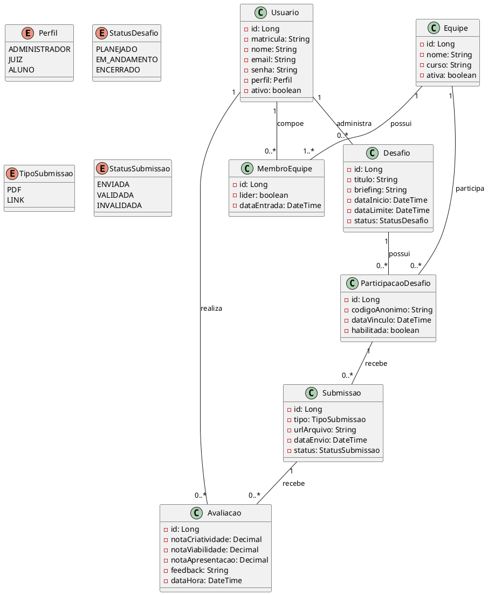

# Mini Mundo: Sistema Jogos Publicitários

## 1. Resumo

O **Prizma Studio** (Estácio West Shopping) promoverá uma competição de desafios de marketing denominada **“Jogos Publicitários”**. Para gerenciar o evento, será desenvolvida uma **plataforma web integrada**, com foco em organização, controle e avaliação das atividades propostas.

A plataforma permitirá ao **Administrador** cadastrar desafios, cadastrar juízes, cadastrar alunos, formar equipes, vincular equipes aos desafios, receber submissões e divulgar automaticamente um ranking com base nas avaliações realizadas.

O sistema terá como principal objetivo garantir uma gestão centralizada do evento, assegurando o controle administrativo, a imparcialidade das avaliações e a visualização clara dos resultados.

---

## 2. Os Atores (Usuários)

* **Administrador (Admin):** responsável pela gestão completa do sistema. É o único usuário com permissão para cadastrar desafios, cadastrar juízes, cadastrar alunos, formar equipes, vincular equipes aos desafios e acompanhar os resultados.
* **Juízes (Avaliadores):** profissionais ou professores que acessam o sistema para visualizar as submissões das equipes de forma anonimizada e atribuir notas segundo critérios pré-definidos.
* **Alunos (Integrantes de Equipe):** usuários cadastrados pelo Administrador, vinculados a uma equipe, que acompanham o desafio, consultam o briefing, realizam o envio da solução e visualizam o feedback recebido.

---

## 3. Fluxo de Funcionamento

1. **Configuração do Desafio:** o Administrador acessa o sistema para criar uma edição de desafio, informando título, briefing, datas e status.
2. **Cadastro de Usuários:** o Administrador realiza o cadastro dos juízes e dos alunos participantes.
3. **Formação das Equipes:** o Administrador organiza os alunos em equipes, definindo seus integrantes e, quando necessário, o líder da equipe.
4. **Vinculação ao Desafio:** o Administrador associa as equipes cadastradas ao desafio correspondente.
5. **Execução:** após a liberação do briefing, as equipes desenvolvem suas propostas e realizam a submissão da solução na plataforma, enviando um arquivo PDF ou um link externo.
6. **Avaliação:** os Juízes acessam a área de avaliação, visualizando as submissões com identificação anonimizada, e registram notas de 0 a 10 em critérios como Criatividade, Viabilidade e Apresentação, além de feedback textual.
7. **Ranking:** o sistema calcula automaticamente a pontuação das equipes com base nas avaliações válidas e gera um ranking exibido na tela principal.

---

## 4. Modelagem de Dados (UML)

---

## 5. Requisitos Funcionais Sugeridos

### Painel Administrativo

* cadastrar, editar e encerrar desafios;
* cadastrar juízes;
* cadastrar alunos;
* formar e editar equipes;
* vincular equipes aos desafios;
* acompanhar submissões;
* consultar avaliações;
* visualizar ranking;
* exportar relatórios.

### Área do Aluno

* autenticar-se no sistema;
* visualizar o desafio de sua equipe;
* acessar o briefing;
* enviar submissões;
* acompanhar o status da submissão;
* visualizar feedback e ranking.

### Área do Juiz

* autenticar-se no sistema;
* acessar os desafios em que atua;
* visualizar submissões anonimizadas;
* atribuir notas por critérios;
* registrar feedback textual.

---

## 6. Notas Técnicas para TI

* **Cadastro Centralizado:** apenas o **Administrador** pode cadastrar juízes, alunos, equipes e desafios.
* **Formação de Equipes:** apenas o **Administrador** pode definir quais alunos pertencem a cada equipe.
* **Participação no Desafio:** uma equipe só participa de um desafio quando for vinculada pelo Administrador.
* **Regra de Negócio:** um aluno pode participar de apenas **uma equipe por desafio**.
* **Submissão:** uma equipe vinculada a um desafio pode realizar mais de uma submissão ao longo do prazo, mas apenas uma poderá ser considerada **válida** para avaliação final.
* **Avaliação:** cada juiz pode avaliar uma mesma submissão apenas **uma vez**.
* **Anonimato:** durante a avaliação, o juiz deve visualizar apenas um **código anônimo** ou identificação fictícia da equipe, sem acesso aos nomes dos integrantes.
* **Ranking:** o ranking é derivado das avaliações válidas, não sendo obrigatória sua persistência como entidade própria.

---

## 7. Considerações sobre Arquitetura

Para a primeira versão, a solução pode ser desenvolvida como uma **aplicação web estruturada em camadas**, priorizando organização, corretude e facilidade de manutenção.

### Abordagens possíveis

**Abordagem 1 — Monolito Web em Camadas**
Indicada para a maior parte das equipes.
Permite treinar:

* MVC;
* autenticação;
* persistência relacional;
* formulários;
* templates;
* validações;
* regras de negócio;
* migrações de banco.

**Abordagem 2 — Front-end + Back-end Separados**
Indicada para equipes mais avançadas.
Permite treinar:

* API REST;
* autenticação entre cliente e servidor;
* integração entre front e back;
* organização modular em dois projetos;
* consumo de endpoints e controle de estados.

### Mobile é necessário?

Não, neste momento. O sistema pode funcionar bem apenas como aplicação web, já que seu foco está em cadastro administrativo, submissão, avaliação e ranking.

### Time de API separado é necessário?

Também não obrigatoriamente. Isso só faz sentido se a proposta da turma for explicitamente trabalhar com front e back desacoplados.

---

## 8. Possíveis Stacks para o Projeto

### Opção 1 — Java Web em Camadas

* Java
* Spring Boot
* Spring MVC
* Thymeleaf
* PostgreSQL
* Flyway
* Bootstrap ou CSS próprio

**Perfil indicado:** grupos que queiram praticar arquitetura clássica, domínio, camadas, autenticação e persistência com forte organização. Spring Boot é voltado a aplicações Java de produção; Flyway favorece migrações versionadas; e PostgreSQL oferece base relacional robusta. ([Home][1])

### Opção 2 — C# Web em Camadas

* C#
* ASP.NET Core MVC
* Razor
* PostgreSQL ou SQL Server
* Entity Framework Core

**Perfil indicado:** grupos que queiram praticar MVC de forma corporativa, com controllers, views, validações e forte organização de projeto. A própria documentação posiciona o ASP.NET Core MVC como framework para web apps e APIs usando MVC. ([Microsoft Learn][2])

### Opção 3 — Python Web Estruturado

* Python
* Django
* Templates do Django
* PostgreSQL

**Perfil indicado:** grupos que queiram produtividade alta sem perder estrutura. Django já inclui autenticação, administração e formulários no ecossistema oficial. ([Django Project][3])

### Opção 4 — PHP Web Estruturado

* PHP
* Laravel
* Blade
* PostgreSQL ou MySQL

**Perfil indicado:** grupos que queiram uma stack moderna e muito prática, mantendo controllers, views, rotas e autenticação bem organizados. Os starter kits oficiais já ajudam com essa base. ([Laravel][4])

### Opção 5 — Separação Moderna de Front e Back

* Vue ou Nuxt no front-end
* NestJS no back-end
* PostgreSQL

**Perfil indicado:** grupos mais avançados, que já consigam lidar bem com API, autenticação e integração entre projetos. Vue usa um modelo declarativo baseado em componentes; Nuxt traz SSR e recursos full-stack; e NestJS enfatiza modularidade e boas práticas estruturais. ([Vue.js][5])

---

## 9. Quantitativo Sugerido de Pessoas

### Versão mínima para MVP

* 1 desenvolvedor back-end
* 1 desenvolvedor front-end ou templates
* 1 líder técnico ou desenvolvedor full stack
* 1 apoio de interface em tempo parcial
* 1 apoio de testes em tempo parcial

### Versão mais confortável

* 2 desenvolvedores back-end
* 1 ou 2 desenvolvedores front-end
* 1 líder técnico
* 1 apoio de interface
* 1 QA

---

## 10. Conclusão

O **Sistema Jogos Publicitários** pode ser implementado como uma aplicação web estruturada, com foco em cadastro centralizado, formação administrativa de equipes, submissões, avaliações e ranking automatizado.

[1]: https://spring.io/projects/spring-boot?utm_source=chatgpt.com "Spring Boot"
[2]: https://learn.microsoft.com/en-us/aspnet/core/mvc/overview?view=aspnetcore-10.0&utm_source=chatgpt.com "Overview of ASP.NET Core MVC"
[3]: https://www.djangoproject.com/start/overview/?utm_source=chatgpt.com "Django overview"
[4]: https://laravel.com/docs/13.x/starter-kits?utm_source=chatgpt.com "Starter Kits | Laravel 13.x - The clean stack for Artisans and ..."
[5]: https://vuejs.org/guide/introduction?utm_source=chatgpt.com "Introduction"
